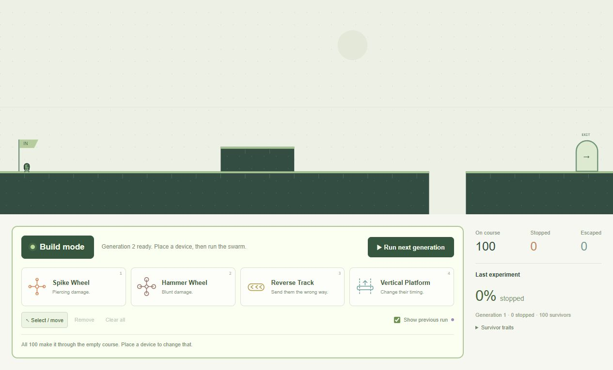

# Swarm / Trap — alpha

**[Play the live demo](https://danjpark.github.io/swarm-trap-prototype/)** ·
[Public repository](https://github.com/danjpark/swarm-trap-prototype)

Place obstacles, run 100 little creatures through the course, and change your
setup after watching what happens. Vite + vanilla TypeScript + Canvas 2D.
No game engine, backend, or runtime dependencies.



## Design rule: the environment starts fair

**Every unmodified level must let all 100 critters reach the exit.** Deaths and
failed runs should come from the player's devices and their effects, not an
inherently lethal default course. This applies to every future level as well as
the current one.

The first course is now short enough to see from start to exit at once. Its hill
and gap remain, but the gap and reaction timing provide safe traversal for the
entire starting population. All 100 spawn together at the same starting point
and spread out naturally as they run. Runners are not invulnerable: wheel damage, altered movement,
and falls after player modifications still count normally.

Register future levels in `src/levels/index.ts`. The regression suite checks
every registered level across 100 seeded populations and every extreme
combination of registered traits from the shared spawn
point. Default level devices are included in these checks. Do not accept a
level that kills unmodified runners.

Default level result: **100 escaped, 0 stopped**, about **8.2 seconds** at the
fixed normal pace. No speed controls or device tuning are exposed in this alpha.

## Play

The page opens directly in **Build mode**. All build tools are grouped below
the full-width course. The large green Build mode button and highlighted panel
indicate that editing is enabled.

1. Pick **Spike Wheel** (piercing), **Hammer Wheel** (blunt), **Reverse Track**, or **Vertical Platform**.
2. Click the course to place the device on the grid.
3. Select or drag a placed device to reposition it; Remove deletes it.
4. Choose **Run swarm**. Building locks while the creatures move.
5. Survivors breed the next generation when a run completes. **Back to build** keeps that generation while you change devices. If none survive, **Start over** returns to generation 1 with your devices intact.

Pause and Restart appear only while a run is underway. **Show previous run**
compares the last completed timeline in lavender with the current green
creatures. The result panel shows generation, survivors, and percent stopped.
Average inherited HP and shell and their changes are hidden under **Survivor traits**.
**Run next generation** starts the offspring from the last completed run. Technical
metrics, trap parameters, scrolling controls,
the tutorial overlay, branding, and the duplicate Preview/Commit buttons are
hidden or removed from the player interface.

Keyboard: **1 / 2 / 3 / 4** selects devices, **Escape** returns to selection,
**Delete / Backspace** removes the selected device, and **Space** pauses/resumes.
Right-click a device to remove it. Start and exit areas are protected; tracks
need ground and platforms need a clear vertical path.

## Run locally

Use Node.js 24 LTS or newer.

```sh
git clone https://github.com/danjpark/swarm-trap-prototype.git
cd swarm-trap-prototype
npm ci
npm run dev
```

Open the URL printed by Vite, normally
`http://localhost:5173/swarm-trap-prototype/`.

- `npm test`: 20 simulation, baseline, editor, camera, and replay tests.
- `npm run build`: strict TypeScript check and production bundle.
- `npm run preview`: production preview at port 4173.
- `npm run benchmark`: developer CPU measurements, outside the player UI.

## Architecture

```text
src/
  game/         modes, editor input, fixed loop, world, full-course camera
  simulation/   runner data, traits, seeded RNG, local sensing, AABB physics
  levels/       level schema, level01, and the tested level registry
  traps/        common contract and the wheel, track, and platform implementations
  rendering/    procedural creatures, terrain, devices, and ghosts
  replay/       15 Hz transform sampling and non-colliding ghost playback
  ui/           grouped build/run controls and generation and survivor averages
  assets/       optional future PNG/WebP sprite and animation definitions
  types/        world geometry
tests/          deterministic regression checks
scripts/        headless benchmark
docs/           screenshot, design decisions, and verification notes
.github/        PR test/build checks and Pages deployment
```

Physics runs at a deterministic 120 Hz; rendering uses requestAnimationFrame.
The camera fits the complete 1,600-unit course horizontally without stretching
its aspect ratio. Simulation logic has no Canvas or DOM dependencies.

Traits are registered in `src/simulation/traits.ts`; gameplay constants live in
`src/simulation/tuning.ts`. HP absorbs both wheel damage types. Shell trades
piercing protection for blunt protection on one axis, with multipliers from
0.5 to 1.5. A device can hit a runner once per 0.3 seconds. The fixed collision
box stays 12×18 even when HP and shell alter the drawing. Only finishers breed;
children inherit each trait from one of two uniformly selected parents and then
receive bounded Gaussian mutation. Breeding uses seed 240519 + generation.

Trap behavior remains
data-driven, but the UI uses fixed defaults. Completed runs are recorded at
15 Hz; aborted runs do not replace the comparison. Ghosts do not affect physics.

A future Godot port maps World to a gameplay scene, runners to CharacterBody2D,
traps to Node2D/Area2D, definitions to Resources, the fixed loop to
`_physics_process()`, and rendering to Sprite2D/AnimatedSprite2D. The port should
preserve the safe-baseline rule, behavior, seeds, and test fixtures.

## Deployment and limitations

Use `main` as the shared source of truth. Prefer short-lived branches based on
the latest `main`, then squash-merge reviewed PRs and delete their branches.
Use separate checkouts when assistants work simultaneously. Small direct changes
on `main` are fine when only one editor is working and tests/build pass first.
Pull requests to `main` run tests and the production build without deploying.

Pushes to `main` and manual dispatch run install → tests → build → Pages
artifact upload → deployment. The publishing source is **GitHub Actions**.
Vite's base is `/swarm-trap-prototype/`; update it if renaming the repository.
The [verification notes](docs/VERIFICATION.md) describe current checks.

Desktop first. Edits and recordings are in memory and reset on reload. Generations and edits last for the page session; there is no saving. At 60 simulated seconds, contained runners
count as stopped. Platforms are one-way, with no crushing or runner-to-runner
collision. Full-course display on small phones makes the creatures small;
mobile interaction is not a target. Firefox/Safari have not been independently
verified. All graphics are original procedural art; see [asset provenance](ASSET_LICENSES.md).

Before making a future Godot repository private, explicitly review Pages:
making a repository private must not be assumed to make its existing public
deployment private. That transition is not part of this alpha.

